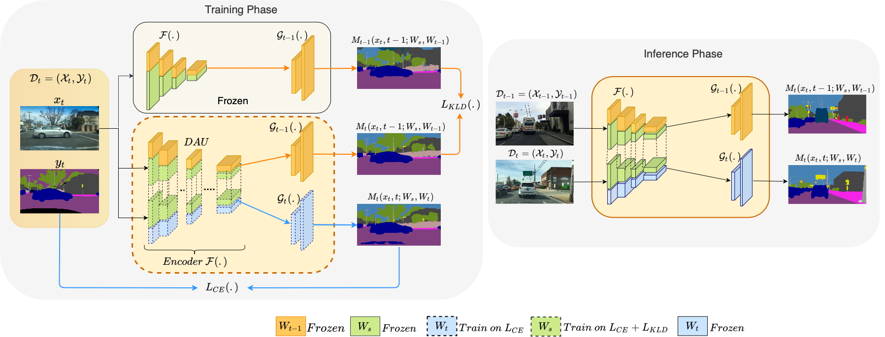

# Multi-Domain Incremental Learning for Semantic Segmentation
This is the Pytorch implementation of our work "Multi-Domain Incremental Learning for Semantic Segmentation", accepted at WACV 2022 (Algorithms Track)

Full paper: http://arxiv.org/abs/2110.12205

**Model checkpoints and evaluation notebook now out for easy reproducibility!**

## Requirements

 - Python 3.6
 - Pytorch: Make sure to install the Pytorch version for Python 3.6 with CUDA support (This code has been run with CUDA 10.2)
 - Models can take upto 40 hours on 2 Nvidia GeForce GTX 1080 Ti GPUs for Step 2; and upto 90 hours on 4 Nvidia GeForce GTX 1080 Ti GPUs for Step 3.

## Datasets

 - Cityscapes: https://www.cityscapes-dataset.com/
 - BDD100k: https://www.bdd100k.com/
 - IDD: Download IDD Part 1 from https://idd.insaan.iiit.ac.in/

**Preprocessing IDD:** convert polygon labels to segmentation masks:

1. Clone [public-code](https://github.com/AutoNUE/public-code)
2. `export PYTHONPATH='../public-code/helpers/'`
3. `python ../public-code/preperation/createLabels.py --datadir <datadir> --id-type level3Id`

## Launching the code

### Training
Training occurs in incremental steps. Model at each subsequent step is initialized from the previous step model. Hence, training in steps 2 and 3 are dependent on previous checkpoints.

Sample commands for the incremental domain sequence **Cityscapes (CS) -> BDD -> IDD**:

_Step 1: Learn model on CS_ \
`python train_RAPFT_step1.py --savedir <savedir> --num-epochs 150 --batch-size 6 --state "trained_models/erfnet_encoder_pretrained.pth.tar" --num-classes 20 --current_task=0 --dataset='cityscapes'`

_Step 2: Learn CS model on BDD_ \
`python train_new_task_step2.py --savedir <savedir> --num-epochs 150 --model-name-suffix='ours-CS1-BDD2' --batch-size 6 --state <path_to_Step1_model> --dataset='BDD' --dataset_old='cityscapes' --num-classes 20 20 --current_task=1 --nb_tasks=2 --num-classes-old 20`

_Step 3: Learn CS|BDD model on IDD_ \
`python train_new_task_step3.py --savedir <savedir> --num-epochs 150 --model-name-suffix='OURS-CS1-BDD2-IDD3' --batch-size 6 --state "path_to_Step2_model" --dataset-new='IDD' --datasets 'cityscapes' 'BDD' 'IDD' --num-classes 20 20 27 --num-classes-old 20 20 --current_task=2 --nb_tasks=3 --lambdac=0.1`

Training commands for the Fine-tuning model, Multi-task (joint, offline) model and Single-task (independent models) can be found in the bash scripts inside `trainer_files` directory. Other ablation experiment files can be requested.

### Pretrained Models
Our checkpoints for (1) Proposed model, (2) Fine-tuning, and (3) Single-Task baselines on ERFNet for CS, BDD and IDD can be found [here](https://drive.google.com/drive/folders/1RrWlm4hismw9srbQJ-Q_-cs_dHUwISqq?usp=sharing). Checkpoints for other settings (like BDD->CS or IDD->BDD) can be released if required.

#### Testing
Refer to jupyter notebook `Evaluation_Notebook.ipynb` for evaluation of our models. Make sure to set suitable paths for dataset, models and checkpoints.

#### T-SNE plots for segmentation
Refer to file `Plot_Tsne_Notebook.ipynb` for T-sne plots. We plot the output of the encoder before and after step 2. We compare finetuning versus our method.

## Citation
`@inproceedings{garg2022multi,
  title={Multi-Domain Incremental Learning for Semantic Segmentation},
  author={Garg, Prachi and Saluja, Rohit and Balasubramanian, Vineeth N and Arora, Chetan and Subramanian, Anbumani and Jawahar, CV},
  booktitle={Proceedings of the IEEE/CVF Winter Conference on Applications of Computer Vision},
  pages={761--771},
  year={2022}
}
`

## Acknowledgements
 - Code was originally borrowed from the ERFNet Pytorch implementation: https://github.com/Eromera/erfnet_pytorch
 - Implementation of the residual adapters has been inspired from:
   - https://github.com/menelaoskanakis/RCM
   - https://github.com/srebuffi/residual_adapters
